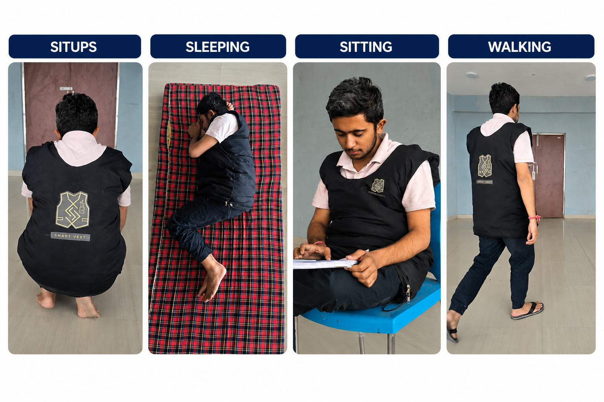
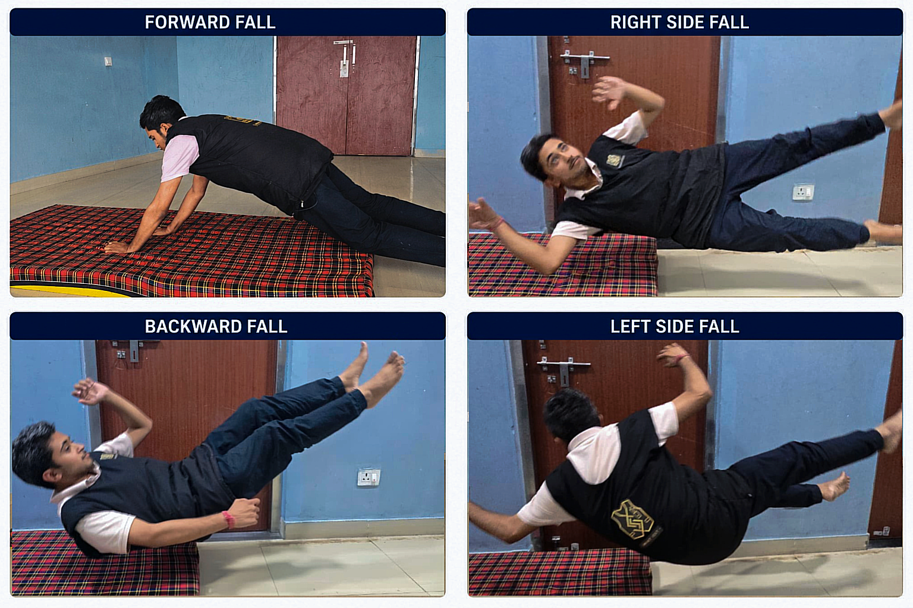
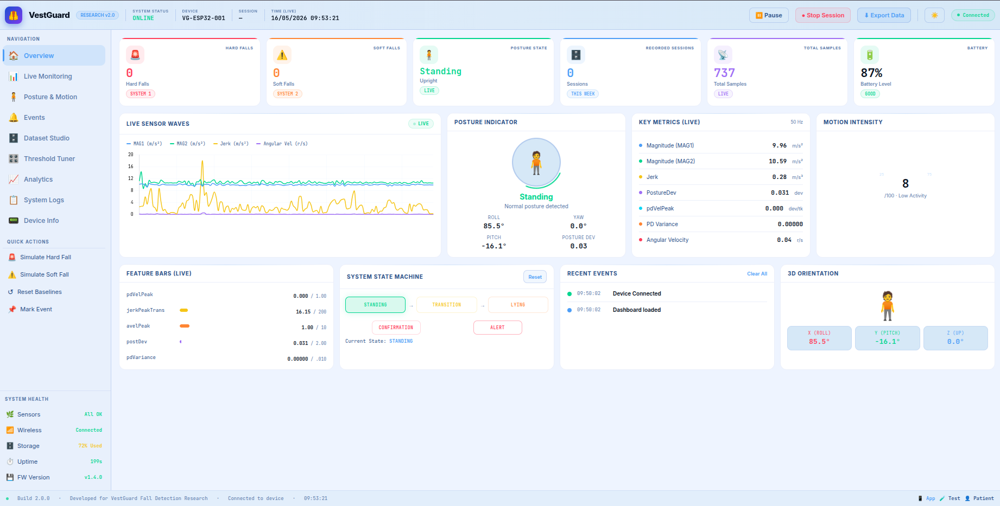
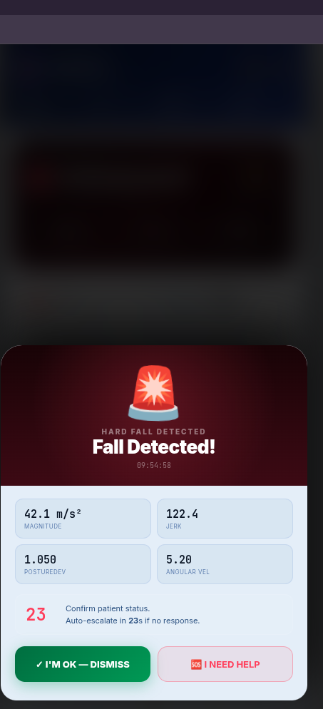

# ⚡ VestGuard
### Intelligent Dual-Mode Fall Detection Wearable System

  
  
  
  

  <b>A smart wearable vest for real-time intelligent fall detection using torso-mounted inertial sensing.</b> 
  Designed for elderly care · Remote patient monitoring · Industrial worker safety

---

## 🎯 The Problem

Falls are the **second leading cause of unintentional injury deaths** globally, with approximately **684,000 fatal falls** occurring every year (WHO, 2024). For elderly individuals and people living alone, the real danger isn't just the fall — it's the delay before help arrives.

Existing wrist-worn and smartphone-based systems fail because:
- ❌ High false alarm rates from unrelated hand movements
- ❌ Unable to detect slow collapses and fainting events
- ❌ Cannot distinguish intentional lying from a genuine fall
- ❌ Dependent on cloud infrastructure or fixed cameras

**VestGuard solves this** with a torso-mounted architecture that captures the body's true center of mass — delivering reliable, real-time detection where it matters most.

---

## 🧠 How It Works

VestGuard runs **two independent detection pipelines simultaneously**:

| System | Target | Approach |
|--------|--------|----------|
| **System 1** | Abrupt hard-impact falls | Multi-vote impact confirmation |
| **System 2** | Slow collapses & fainting | Five-state posture transition machine |

The dual-mode architecture ensures both sudden falls and gradual collapses are reliably detected — something no single-threshold system can achieve.

---

## 📊 Performance Results

Evaluated across **135 experimental trials** covering falls, daily activities, and high-intensity movements:

| Metric | Result |
|--------|--------|
| 🎯 Hard Fall Detection | **86.6%** sensitivity |
| 🫀 Soft Fall / Faint Detection | **76.0%** sensitivity |
| ✅ False Alarm Specificity | **88.3%** across ADL |
| ⚡ Forward Fall Detection | **100%** detection rate |

---

## 📸 System in Action

### Wearable Prototype — Activities of Daily Living Testing

> The vest was tested across situps, sleeping, sitting, walking and many more daily activities to ensure minimal false alarms during normal use.

<!-- ADL IMAGE -->

---

### Simulated Fall Scenarios

> Hard falls, sideward falls, backward falls, and soft collapses were evaluated under controlled conditions.

<!-- FALLS IMAGE -->

---

### Live Research Dashboard

> Real-time sensor visualisation, posture monitoring, threshold tuning, and session recording — all from a browser.

<!-- DASHBOARD IMAGE -->

---

### Caregiver Mobile Application

> Emergency alerts with live motion data sent instantly to caregivers when a fall is confirmed.

---

## 🎬 See It Working

### Scan to watch the live demo

*Real-time fall detection · Dashboard monitoring · Emergency alert demo*

---

## 🔬 Key Innovations

- **Dual-mode detection** — handles both hard impacts and gradual collapses
- **Cancel-gate mechanism** — distinguishes intentional lying from genuine falls
- **Transition fingerprint scoring** — weighted analysis of posture change patterns
- **Adaptive posture reference** — compensates for gradual vest displacement during wear
- **Edge deployment** — all processing on-device, no cloud dependency
- **Real-time caregiver app** — instant emergency notification pipeline

---

## 🔭 What's Next

- [ ] TinyML integration for improved soft-fall classification
- [ ] Heart rate & SpO₂ monitoring for medical emergency detection
- [ ] Hardware miniaturisation with custom PCB design
- [ ] Multi-subject clinical validation
- [ ] Offline emergency communication via GSM / LoRaWAN
- [ ] Cloud-based long-term mobility analytics

---

## 👥 Team

| Name | Role |
|------|------|
| **Arpit Awasthi** | Team Lead · System Architecture · Algorithm Design |
| Abhishek Kumar | Hardware Integration |
| Ashutosh Sharma | Firmware Development |
| Neelaksh Thakur | Dashboard & Communication |
| Yogit | Testing & Evaluation |

**Supervisor:** Er. Ravi Kumar, Assistant Professor  
Government Hydro Engineering College, Bilaspur, HP

---

## ⚠️ Important Notice

> This is an **active research project**. Source code, circuit designs, firmware, and technical implementation details are **not publicly available** as the work is currently under research review and intellectual property protection proceedings.
>
> For research collaborations or inquiries, contact: [awasthiarpit24@gmail.com](mailto:awasthiarpit24@gmail.com)

---

**VestGuard** · Government Hydro Engineering College Bilaspur · 2026  
Made with dedication for safer lives 🛡️

